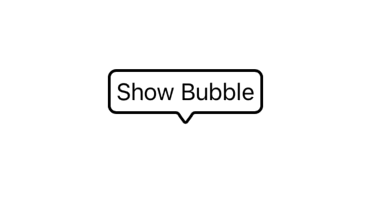

# SwiftUI Bubble

 

This package provides you with an easy way to show tooltips over any SwiftUI view, since Apple does not provide one.

```swift
import SwiftUIBubble
...
Text("Bubble Text")
    .bubble()
...
```

## Getting started

You can add this package to your project using Swift Package Manager. Enter following url when adding it to your project package dependencies:

```
https://github.com/woonhyeong/SwiftUI-Bubble.git
```

## Usage

### Basic use case

As the first example, the `Text` view is provided as the bubble content and it's attached to the other view.
Below you can see the example of code that is required to create the tooltip and the result you see on the screen.

*Code:*

```swift
import SwiftUIBubble
...
Text("Show Bubble")
    .bubble()
...
```

*Result:*



### Using custom configuration

Second example shows you how you can add configuration to the bubble for additional options.

*Code:*

```swift
import SwiftUI
import SwiftUIBubble

struct SwiftUIView: View {
    var body: some View {
        Text("Show Bubble")
            .bubble { configuration in
                configuration
                    .border(BubbleBorder(width: 3, color: .green))
                    .innerPadding(EdgeInsets(top: 10, leading: 10, bottom: 10, trailing: 10))
                    .arrowAlignment(.top)
            }
    }
}
```

*Result:*


## Configuration Reference

Below you can see all the properties that you can set in the configuration.

| Property               | Type          | Description                                          |
| ---------------------- | ------------- | ---------------------------------------------------- |
| `arrowAlignment`                 | `BubbleArrowAlignment` | Side of view that the tooltip should appear on top or bottom      |
| `arrowHeight`               | `CGFloat`     | Bubble arrow's height |
| `innerPadding`         | `EdgeInsets`     | Padding from the bubble to the view it's attached to                               |
| `border`          | `BubbleBorder`     | Thickness, Border, CornerRadius of the border                              |
